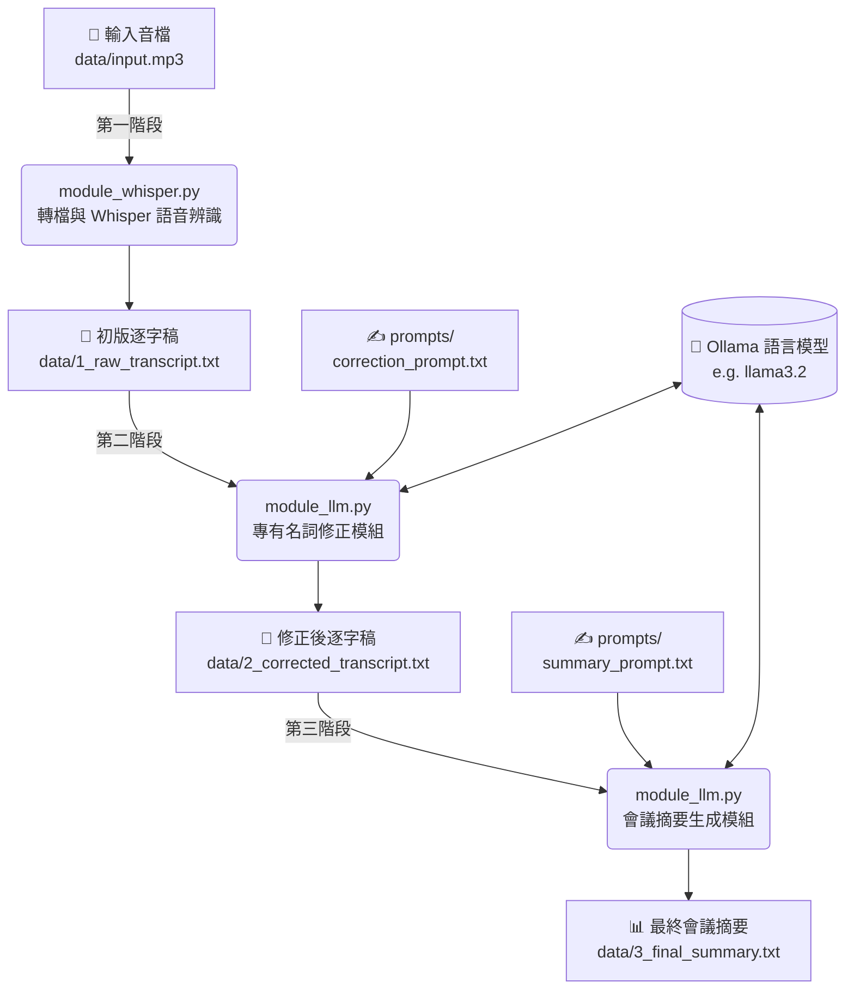

# Meeting Tool 專案

這是一個自動將會議錄音轉成逐字稿，並修正專有名詞、生成會議摘要的工具專案。

## 系統架構預期 (Pipeline Architecture)

以下為本專案的自動化處理管線，主流程由 `main.py` 依序調用模組：



## 1. 架設 Ollama 語言模型服務

關於你提到想使用「Gemini 3B」：Google 的「Gemini」系列是雲端模型，它的開源地端版本叫作 **Gemma**。但目前官方推出的 Gemma 參數規模是 2B 與 9B，並沒有出 3B 的版本 (你指的可能是 Gemini Nano，不過它目前沒有官方釋出的 Ollama 模型檔)。

如果你一定要堅持使用 **「3B」參數級距** 的模型，目前市場上最強的開源 3B 模型是 Meta 推出的 **Llama 3.2 (3B)** 或阿里開源的 **Qwen2.5 (3B)**。這裡我們先幫你把專案改用 `llama3.2` (正好是 3B 參數) 或 `qwen2.5:3b`。以下以 Llama 3.2 為例：

### 安裝與啟動步驟

1. **下載與安裝 Ollama (Linux 一鍵安裝方式)**：
   在終端機 (Terminal) 中執行以下指令即可自動安裝 Ollama：
   ```bash
   curl -fsSL https://ollama.com/install.sh | sh
   ```
   *安裝完成後，系統通常就會自動在背景啟動 Ollama 服務了。*

2. **啟動並下載 3B 語言模型**：
   接著在終端機輸入以下指令，下載並啟動 `llama3.2` (3B 參數版本)：
   ```bash
   ollama run llama3.2
   ```
   *(如果你想用 Qwen 3B，可改打 `ollama run qwen2.5:3b`)*

   * 第一次執行時會下載模型 (約需 2.0GB)。
   * 下載完成後進入對話介面即代表服務已經在本機背景執行 (預設 API 網址為 `http://localhost:11434/api/generate`)。
   * 您可以隨時輸入 `/bye` 退出對話介面，但模型 API 服務仍會在背景運行等待外部呼叫。

---

## 2. 測試會議摘要指令 (使用假資料)

在 Ollama 服務已經運行 (`http://localhost:11434`) 的情況下，你可以執行本專案內的 `summarize.py`。這個腳本裡已包含一段假的會議逐字稿，用作測試。

### 執行準備

1. 安裝必要的 Python 套件 (如 `requests`)：
   ```bash
   pip install -r requirements.txt
   ```

2. 執行摘要腳本：
   ```bash
   python summarize.py
   ```

---

## 3. 🧪 Prompt 工程：如何測試 Prompt

如果你是負責優化提示詞 (Prompt) 的組員，我們準備了 `test_prompt.py` 小工具，讓你可以在自己的電腦上，直接用 CMD 呼叫伺服器平台上的 Ollama 模型來測試結果。

### 步驟 A：開放主機 Ollama 外部連線 (僅平台主機端需要)
預設情況下 Ollama 只允許本機 (`localhost`) 連線。如果要讓組員從外部網路連線，伺服器在啟動 Ollama 時必須加上環境變數開放所有 IP：
```bash
# 在 Linux 主機端啟動 Ollama 前設定
OLLAMA_HOST=0.0.0.0 ollama run llama3.2
```

### 步驟 B：組員從本機 (CMD) 測試 Prompt
組員可以在自己的電腦上下載專案內的 `test_prompt.py`，並自己隨意建立你要測試的 `my_prompt.txt` 與情境假文章 `test_speech.txt`。
打開命令提示字元 (CMD) 或終端機，執行以下指令：

```bash
python test_prompt.py --host http://<平台的IP地址>:11434 --prompt my_prompt.txt --text test_speech.txt
```
*這支小程式會自動把你的 Prompt 和測試文章組合，發送給伺服器，並把 AI 產出的結果印在畫面上。團隊就可以利用這支小工具，透過反覆修改 txt 檔來找出最強的 Prompt！*
